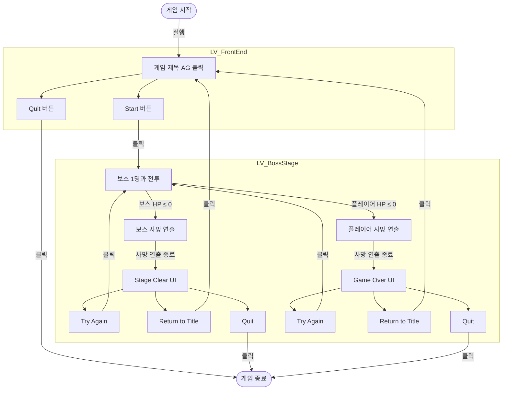

# 게임 플로우

게임 시작부터 보스전의 끝까지 레벨 전환 규칙, 보스전의 시작과 결과, 각 화면의 UI를 정의합니다.

용어는 [용어집](<../용어집.md>)을 따릅니다.

> 구현 우선순위: 🔴 S / 🟡 A / 🟢 B (기준은 [마일스톤1 계획](<마일스톤1 계획.md>) 참고)

## 1. Front End

LV_FrontEnd는 게임을 실행하면 처음 열리는 레벨입니다.

Start 버튼을 누르면 보스전 스테이지(LV_BossStage)로 이동합니다.

Quit 버튼을 누르면 게임을 종료합니다.

## 2. Boss Stage

LV_BossStage는 보스전이 진행되는 레벨입니다. 구성은 [보스 스테이지](<보스 스테이지.md>)를 따릅니다.

레벨이 열리면 바로 보스전이 시작되며, 플레이어는 시작 지점에서 바로 조작할 수 있습니다. 보스가 전투를 시작하는 방식은 [보스 사양](<보스 사양.md>)의 '전투 시작과 행동 전환'을 따릅니다.

레벨이 열리면 마우스 커서를 숨기고, 입력은 게임만 받습니다.

보스전의 결과는 먼저 처리된 사망으로 정해집니다. 결과가 정해진 뒤 상대가 사망하면 사망 연출은 재생하지만, 결과와 결과 UI는 바뀌지 않습니다.

LV_BossStage를 다시 시작하면 레벨을 처음부터 다시 로드하며, 플레이어와 보스의 모든 상태(스탯, 페이즈 등)를 초기화합니다.

## 3. Stage Clear

보스의 HP가 0 이하가 되면, 보스의 사망 연출이 재생되고 Stage Clear UI 창이 출력됩니다. 이미 결과가 정해진 뒤에 사망한 경우는 'Boss Stage'를 따릅니다.

Try Again 버튼을 누르면 LV_BossStage를 다시 시작합니다.

Return to Title 버튼을 누르면 LV_FrontEnd 레벨로 돌아갑니다.

Quit 버튼을 누르면 게임을 종료합니다.

## 4. Game Over

플레이어 캐릭터의 HP가 0 이하가 되면, 플레이어 캐릭터의 사망 연출이 재생되고 Game Over UI 창이 출력됩니다. 이미 결과가 정해진 뒤에 사망한 경우는 'Boss Stage'를 따릅니다.

Try Again 버튼을 누르면 LV_BossStage를 다시 시작합니다.

Return to Title 버튼을 누르면 LV_FrontEnd 레벨로 돌아갑니다.

Quit 버튼을 누르면 게임을 종료합니다.

## 화면 UI

기준 해상도, 화면 여백, 글자 크기, 버튼 스타일은 [UI 스타일](<UI 스타일.md>)을 따릅니다.

### 타이틀 화면 (🔴 S)

LV_FrontEnd에 표시하는 화면입니다.

- 화면 위쪽 가운데에 게임 제목 'AG'를 크게 표시합니다. (전용 글자 Size 168)
- 제목 아래 가운데에 Start, Quit 버튼을 세로로 배치합니다. (글자 Large)
- 레벨이 열리면 마우스 커서를 표시합니다.
- 처음 선택된 버튼은 Start입니다.

### Stage Clear UI / Game Over UI (🔴 S)

| 항목 | Stage Clear UI | Game Over UI |
| - | - | - |
| 제목 문구 | STAGE CLEAR | GAME OVER |
| 버튼 | Try Again, Return to Title, Quit (세로 배치) | Try Again, Return to Title, Quit (세로 배치) |

- 글자 크기는 제목 Size 84(전용 글자), 버튼 Large입니다.
- 사망 연출이 끝나면 0.5초 동안 화면을 서서히 어둡게 하면서 결과 UI를 서서히 표시합니다. 어두운 정도는 각 화면의 그림을 따릅니다. 버튼 입력은 표시가 끝난 뒤부터 받습니다.
- 결과 UI가 떠 있는 동안 게임은 멈추지 않으며, 플레이어 입력은 UI만 받습니다. 마우스 커서를 표시합니다.
- 처음 선택된 버튼은 Try Again입니다.

### UI 조작

| 동작 | 키 |
| - | - |
| 버튼 선택 | 마우스 이동, 또는 W·S, ↑·↓ |
| 실행 | 좌클릭, 또는 Enter, Space |

- 맨 위나 맨 아래 버튼에서 더 넘어가는 방향을 누르면 선택이 그대로 멈춥니다. 반대쪽 끝으로 돌아가지 않습니다.
- 마우스와 키보드를 섞어 쓰면 마지막으로 움직인 장치를 따릅니다. 마우스를 버튼 위로 움직이면 그 버튼이 선택되고, 키보드는 지금 선택된 버튼에서 이어서 움직입니다.

## 플로우 차트

