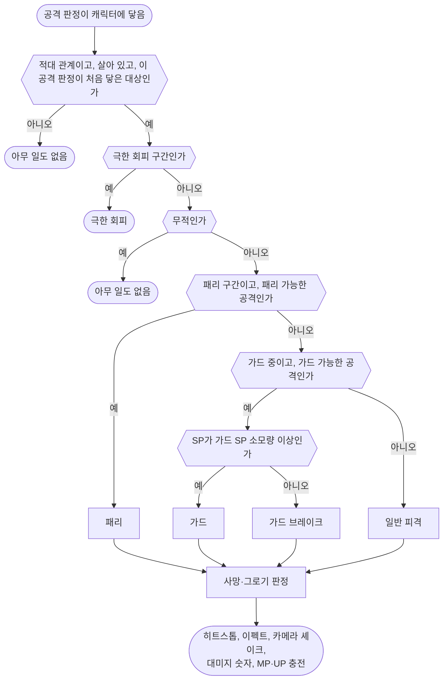

# 전투 시스템

모든 캐릭터에 공통적으로 적용되는 전투 규칙을 서술합니다.

기획서에 적지 않은 캐릭터 설정(캡슐 크기, 가속, 감속, 회전 속도, 점프, 중력, 공중 제어 등)은 엔진 기본값을, 모션의 길이·이동 거리·타이밍(선딜, 판정 구간, 후딜 등)은 모션을 따릅니다.

용어는 [용어집](<용어집.md>)을 따릅니다.

## 스탯

각 캐릭터가 가지는 스탯입니다.

| 스탯 | 명칭 | 최소값 | 최대값 | 설명 |
| - | - | - | - | - |
| HP | 체력 | 0 | MaxHP | 0 이하면 사망 |
| MaxHP | 최대 체력 | 0 | ∞ | |
| SP | 스태미나 | 0 | MaxSP | 회피, 달리기, 가드로 막은 공격의 코스트 |
| MaxSP | 최대 스태미나 | 0 | ∞ | |
| MP | 마나 | 0 | MaxMP | 스킬 발동의 코스트 |
| MaxMP | 최대 마나 | 0 | ∞ | |
| UP | 궁극기 포인트 | 0 | MaxUP | 궁극기 발동의 코스트 |
| MaxUP | 최대 궁극기 포인트 | 0 | ∞ | |
| PP | 강인도 | 0 | MaxPP | 0 이하면 그로기 |
| MaxPP | 최대 강인도 | 0 | ∞ | |
| ATK | 공격력 | 0 | ∞ | 대미지 계산 시 사용 |
| DEF | 방어력 | 0 | ∞ | 대미지 계산 시 사용 |
| MOV | 이동속도 | 0 | ∞ | 캐릭터 이동 속도 |

캐릭터별 스탯 값은 [플레이어 사양](<플레이어 사양.md>), [보스 사양](<보스 사양.md>) 문서에 정의합니다.

## 공격 판정

공격 판정(무기, 투사체, 공격 범위 등)이 캐릭터에 닿으면 '피격 처리 순서'에 따라 처리합니다.

공격이 대상에게 닿았는지 검사하는 단위 하나를 '공격 판정'이라 하며, 1타가 공격 판정 하나입니다. 공격 모션에서 공격 판정이 켜져 있는 구간은 '판정 구간'이라 합니다.

### 공격 판정 세부 규칙

- 하나의 공격 판정(1타)은 같은 대상에게 한 번만 적중합니다. 여러 번 타격하는 공격은 타마다 별도의 공격 판정으로 정의합니다.
- 무적 상태인 대상에게 공격 판정이 닿으면 아무 일도 일어나지 않습니다. 대미지, PP 감소, 피격 반응, 히트스톱, 피격 이펙트, 카메라 셰이크, 대미지 숫자, MP·UP 충전이 모두 없습니다. 단, 회피의 극한 회피 구간에 닿은 공격은 극한 회피를 발동합니다. ([플레이어 사양](<플레이어 사양.md>) 참고)
- 무적일 때 닿은 공격 판정은 무적이 끝난 뒤 계속 닿아 있어도 그 대상에게 적중하지 않습니다.
- 공격은 적대 관계인 캐릭터에게만 적중합니다. (플레이어 ↔ 보스)
- 가드와 패리는 공격이 들어온 방향을 따지지 않습니다.
- 공격 방향은 공격자의 캡슐 중심에서 피격자의 캡슐 중심을 향하는 수평 방향입니다. 투사체는 투사체의 위치를 기준으로 합니다.
- 가드 불가 공격은 가드 중이어도 가드 경감 배율을 적용하지 않고 일반 피격으로 처리합니다.
- 패리(가드를 새로 시작한 직후의 짧은 구간에 공격을 받아 내는 것) 규칙은 [플레이어 사양](<플레이어 사양.md>) 문서에 정의합니다.

### 공격 데이터

모든 공격 판정(1타)은 아래 값을 가집니다. 공격별 값은 각 캐릭터 사양 문서에 정의합니다.

| 항목 | 설명 | 기본값 |
| - | - | - |
| 대미지 배율 (DamageMultiplier) | HP 감소량 계산식의 배율 | 1.0 |
| PP 배율 (PoiseMultiplier) | PP 감소량 계산식의 배율 | 1.0 |
| 피격 반응 | 피격 시 재생할 반응 (피격 반응 항목 참고) | 움찔 |
| 가드 가능 | 불가면 가드로 막을 수 없습니다. | 가능 |
| 패리 가능 | 불가면 패리할 수 없습니다. 가드 불가 공격은 항상 패리 불가입니다. | 가능 |

## 피격 처리 순서

공격 판정이 캐릭터에 닿으면 아래 순서로 처리합니다.

결과별 처리는 아래와 같습니다. HP, PP, SP는 피격자의 값입니다. 단, 패리는 공격자의 PP를 감소시킵니다.

| 결과 | HP | PP | SP | 반응 |
| - | - | - | - | - |
| 패리 | 감소 없음 | 공격자의 PP 감소 | 소모 없음 | 패리 모션 |
| 가드 | HP 감소량 × 가드 경감 배율 | 감소 없음 | 가드 SP 소모량만큼 소모 | 가드 반응 |
| 가드 브레이크 | HP 감소량 × 가드 경감 배율 | 감소 없음 | 0이 됨 | 가드 브레이크 모션 |
| 일반 피격 | HP 감소량 | PP 감소량 | 소모 없음 | 피격 반응 |

- 사망·그로기 판정: HP가 0 이하면 사망, PP가 0 이하면 그로기가 됩니다. 패리로 줄어든 PP는 공격자를 기준으로 판정합니다.
- 마지막 단계의 각 항목은 히트스톱(이 문서), 카메라 셰이크([카메라](<카메라.md>)), 대미지 숫자([전투 HUD](<전투 HUD.md>)), MP·UP 충전([플레이어 사양](<플레이어 사양.md>))을 따릅니다.
- 마지막 단계의 이펙트는 피격 이펙트입니다. (🟢 B) 패리는 피격 이펙트 대신 [플레이어 사양](<플레이어 사양.md>)의 패리 전용 이펙트를 재생합니다. 쓰는 에셋은 [마일스톤1 계획](<마일스톤1 계획.md>)의 아트 리소스를 따릅니다.
- 극한 회피, 패리, 가드, 가드 브레이크의 세부 규칙은 [플레이어 사양](<플레이어 사양.md>)을 따릅니다.
- 사망과 그로기는 '상태 우선순위'에 따라 피격 반응과 가드 반응보다 우선합니다.

## 대미지

공격이 적중했을 때 HP와 PP를 감소시키는 효과입니다. 줄어드는 양은 HP 감소량과 PP 감소량이라 하며, 각각 아래 'HP 감소량 계산식'과 'PP 감소량 계산식'을 따릅니다.

HP 감소량과 PP 감소량은 계산식으로 구한 값(가드 경감 배율 포함)의 소수점 아래를 반올림한 정수로 적용합니다. HP는 회복하지 않으므로, 이렇게 하면 HP가 늘 정수로 남아 화면의 HP 수치와 대미지 숫자가 실제로 줄어든 양과 같습니다. HP가 0.4처럼 남아 화면에는 0인데 살아 있는 일도 생기지 않습니다. PP 감소량도 같은 대미지라 함께 반올림합니다.

### HP 감소량 계산식

$$
\text{HP 감소량} = \text{ATK}_{\text{source}} \times \text{DamageMultiplier} \times \frac{100}{100 + \text{DEF}_{\text{target}}}
$$

| 항 | 뜻 |
| - | - |
| ATK_source × DamageMultiplier | 공격자의 ATK에 공격마다 정한 대미지 배율을 곱한 값 |
| 100 / (100 + DEF_target) | 피격자의 DEF에 따른 감소 비율. DEF가 높을수록 작아지며, DEF 100이면 0.5입니다. |

가드로 막으면(가드 브레이크 포함) HP 감소량에 가드 경감 배율(GuardReduction) 0.5를 곱합니다.

무적 상태의 처리는 '공격 판정 세부 규칙'을 따릅니다.

### PP 감소량 계산식

공격이 적중하면 HP와 함께 PP도 감소합니다.

$$
\text{PP 감소량} = \text{ATK}_{\text{source}} \times \text{PoiseMultiplier} \times \frac{100}{100 + \text{DEF}_{\text{target}}}
$$

| 항 | 뜻 |
| - | - |
| ATK_source × PoiseMultiplier | 공격자의 ATK에 공격마다 정한 PP 배율을 곱한 값. PP 배율은 대미지 배율과 따로 정하며, 두 배율은 서로 영향을 주지 않습니다. |
| 100 / (100 + DEF_target) | HP 감소량 계산식과 같습니다. |

- 가드로 막은 공격은 PP를 감소시키지 않으므로 GuardReduction이 없습니다. 가드 시의 자원 소모는 [플레이어 사양](<플레이어 사양.md>)을 따릅니다.
- 무적, 그로기 상태에서는 PP가 감소하지 않습니다.
- 패리처럼 HP 감소 없이 PP만 감소시키는 효과는 해당 사양 문서에서 수치를 정의합니다.

### PP 리젠

마지막으로 PP가 감소한 뒤 '리젠 대기 시간'(6초)이 지나면 매초 '초당 회복량'만큼 MaxPP까지 회복합니다.

리젠 대기 중이나 리젠 중에 PP가 다시 감소하면 리젠 대기 시간을 처음부터 다시 셉니다.

PP의 리젠 대기 시간은 모든 캐릭터가 같으며, 초당 회복량은 각 캐릭터 사양 문서에 정의합니다.

## 피격 반응

공격에 맞거나 가드로 막았을 때 재생하는 피격 모션과 가드 반응, 그리고 이와 관련된 규칙을 다룹니다.

넉백, 다운, 가드 밀림, 가드 브레이크, 패리 모션은 공격이 들어온 쪽으로 몸을 돌린 뒤 재생합니다. 그래서 어느 방향에서 공격을 받아도 공격 반대쪽으로 밀려나거나 쓰러집니다. 공격이 들어온 방향은 '공격 판정 세부 규칙'의 공격 방향을 따릅니다.

### 피격 모션

공격에 맞으면 공격의 피격 반응에 따라 피격 모션을 재생합니다.

| 피격 반응 | 피격 모션                | 하던 행동 | 비고                          |
| ----- | -------------------- | ----- | --------------------------- |
| 없음    | 없음                   | 계속    |                             |
| 움찔    | 움찔함                  | 계속    | 하던 동작 위에 피격 모션을 덧입혀 재생      |
| 넉백    | 뒤로 크게 밀려남            | 중단    |                             |
| 다운    | 쓰러졌다가 일어남            | 중단    | 바닥에 쓰러진 순간부터 기상이 끝날 때까지 무적  |

- 움찔은 하던 행동(공격, 패턴 등)을 중단시키지 않으며, 상태 우선순위의 상태로 취급하지 않습니다.
- 넉백, 다운은 하던 행동을 중단시킵니다. 피격 모션이 끝날 때까지 이동, 공격, 회피, 가드 등 모든 행동을 할 수 없습니다.
- 넉백, 다운 중 다시 피격되면 새로운 공격의 피격 반응으로 피격 모션을 처음부터 다시 재생합니다. 움찔은 진행 중인 피격 모션을 바꾸지 않습니다.

### 가드 반응

가드로 공격을 막으면 피격 모션 대신 가드 반응이 적용됩니다.

| 막은 공격의 피격 반응 | 가드 반응 | 행동 제한 |
| - | - | - |
| 없음 | 없음 | 없음 |
| 움찔 | 가드 움찔 | 없음. 가드 자세 위에 모션을 덧입혀 재생 |
| 넉백, 다운 | 가드 밀림 | 모션이 끝날 때까지 가드 자세를 유지하며 다른 행동 불가 |

- 가드 밀림 중에 받은 공격도 가드로 막습니다.

### 슈퍼아머

슈퍼아머 상태에서는 넉백, 다운이 발생하지 않습니다. 하던 행동을 계속하며 밀려나지도 않습니다. 대미지(HP와 PP 감소)는 정상적으로 적용됩니다.

움찔은 원래 하던 행동을 중단시키지 않으므로 슈퍼아머 중에도 재생합니다.

슈퍼아머는 보스에게만 상시 적용합니다. ([보스 사양](<보스 사양.md>) 참고)

### 히트스톱

공격이 적중하면 타격감을 위해 공격자와 피격자의 모션을 0.12초 동안 멈춥니다. 월드 전체가 아닌 두 캐릭터에만 적용합니다.

- 가드로 막거나 패리한 경우에도 같은 히트스톱을 적용합니다.
- 처형에는 히트스톱을 적용하지 않습니다.
- 투사체가 적중하거나 가드 또는 패리되면, 투사체를 쏜 캐릭터는 멈추지 않고 맞거나 막거나 패리한 캐릭터에게만 적용합니다.

#### 히트스톱 중의 시간

히트스톱은 두 캐릭터의 모션과 이동만 멈춥니다.

| 구분 | 히트스톱 중 | 해당하는 시간 |
| - | - | - |
| 모션을 따라 흐르는 시간 | 함께 멈춤 | 선딜, 판정 구간, 후딜, 무적 구간, 극한 회피 구간, 보스 패턴 안의 모든 시간 |
| 그 밖의 시간 | 계속 흐름 | 쿨다운, 패리 구간, 회피 반격 기회, 그로기 지속 시간, 리젠 대기 시간과 자원 회복, 슬로우모션 |

- 히트스톱이 걸린 만큼 진행 중인 행동과 보스의 패턴은 늦게 끝납니다.
- 히트스톱 시간은 슬로우모션의 영향을 받습니다. 슬로우모션 중에는 실제 시간으로 더 길게 멈춥니다.

## 그로기

PP가 0 이하가 되면 그로기 상태가 됩니다.

- 지속 시간은 5초입니다. 그로기 모션의 시작부터 원래 자세로 돌아오는 모션의 끝까지를 모두 포함합니다.
- 그로기가 시작되면 진행 중인 모든 행동(패턴 등)을 즉시 중단합니다.
- 그로기 중에는 어떤 행동도 할 수 없습니다.
- 그로기 중에도 HP는 정상적으로 감소합니다. PP는 감소하지 않으며, 넉백, 다운은 발생하지 않습니다.
- 그로기 중 HP가 0 이하가 되면 즉시 사망합니다.
- 그로기 상태인 적은 플레이어에게 처형당할 수 있습니다. ([플레이어 사양](<플레이어 사양.md>) 참고) 처형당한 적은 처형 피격 모션을 재생하고, 이 모션이 끝나 일어서면 남은 시간과 관계없이 그로기가 종료됩니다. 처형이 지속 시간을 넘겨 이어지면 그로기도 그만큼 길어집니다.
- 그로기가 끝나면 PP가 MaxPP로 회복됩니다.
- 플레이어는 그로기에 빠지지 않습니다. ([플레이어 사양](<플레이어 사양.md>)의 스탯 참고)

## 사망

HP가 0 이하가 되면 사망합니다. 레벨의 Kill Z 아래로 떨어진 캐릭터는 HP를 즉시 0으로 만들어 사망 처리합니다.

### 사망 처리

사망하는 즉시 아래 내용을 순서대로 처리합니다.

1. 진행 중인 모든 행동을 중단합니다.
2. 이후 이 캐릭터에 닿는 공격 판정은 아무 일도 일으키지 않습니다. ('피격 처리 순서' 참고)
3. 입력(플레이어) 또는 AI(보스)를 정지합니다.
4. 사망한 캐릭터의 공격 판정을 모두 제거합니다. 이미 발사된 투사체도 즉시 소멸합니다.
5. 캐릭터 간 충돌을 해제하여 상대 캐릭터의 이동을 막지 않게 합니다.
6. 사망하는 순간 래그돌로 바꾸고, 마지막 공격이 들어온 방향으로 밀려납니다. 쓰러진 몸은 그대로 남습니다. 처형으로 사망한 적은 처형 사망 모션을 끝까지 재생한 뒤 래그돌로 바꿉니다.

### 사망 연출

사망 연출의 세부 내용은 각 캐릭터 사양 문서에 정의합니다.

사망 연출이 끝나면 [게임 플로우](<게임 플로우.md>)에 따라 Stage Clear 또는 Game Over UI를 출력합니다.

## 상태 우선순위

캐릭터의 상태는 아래 우선순위를 따릅니다. 높은 상태는 낮은 상태를 중단시키며, 낮은 상태는 높은 상태를 중단시킬 수 없습니다.

| 우선순위 | 상태 |
| - | - |
| 1 | 사망 |
| 2 | 처형 (처형하는 중, 처형당하는 중) |
| 3 | 그로기 |
| 4 | 넉백, 다운, 가드 밀림, 가드 브레이크 |
| 5 | 일반 행동 (플레이어: 이동, 점프, 평타, 회피, 회피 반격, 가드, 스킬, 궁극기 / 보스: 이동, 패턴) |

- 4순위 상태끼리는 나중에 발생한 상태가 먼저 발생한 상태를 중단시킵니다. 5순위 행동끼리의 전환은 [플레이어 사양](<플레이어 사양.md>)의 행동 가능 표를 따릅니다.
- 처형하는 플레이어가 후딜에서 다른 행동으로 모션 캔슬하는 경우는 [플레이어 사양](<플레이어 사양.md>)의 행동 가능 표를 따릅니다. 보스의 처형 피격·사망 모션 처리는 같은 문서의 '처형'을 따릅니다.
