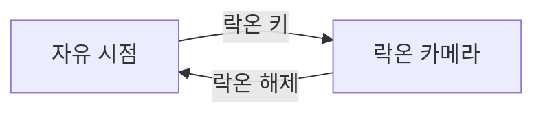

# 카메라

플레이어 시점 카메라의 기본 설정, 락온 카메라, 카메라 셰이크를 정의합니다.

용어는 [용어집](<용어집.md>)을 따릅니다.

> 구현 우선순위: 🔴 S / 🟡 A / 🟢 B (기준은 [마일스톤1 계획](<마일스톤1 계획.md>) 참고)

## 개요

| 항목 | 내용 |
| - | - |
| 방식 | 플레이어 캐릭터 뒤에서 따라가는 3인칭 카메라 |
| 조작 | 마우스 이동으로 회전합니다. ([플레이어 사양](<플레이어 사양.md>)의 조작 참고) |
| 카메라 모드 | 자유 시점, 락온 카메라 |

## 카메라 모드

| 모드 | 사용 상황 | 시야 입력 |
| - | - | - |
| 자유 시점 | 기본 상태 | 받음 |
| 락온 카메라 | 락온 중 | 무시 |

## 자유 시점 (🔴 S)

| 항목 | 값 |
| - | - |
| 카메라 거리 | 400cm |
| 회전 중심 | 캐릭터 캡슐 중심에서 위로 60cm |
| 화면 속 캐릭터 위치 | 화면 가로 가운데 (어깨 너머 시점이 아님) |
| 시야각 (FOV) | 90° |
| 위치 추적 | 캐릭터를 약간 늦게 따라가 이동 중의 화면 떨림을 줄입니다. (따라잡는 시간 약 0.1초) |
| 회전 반응 | 마우스 입력을 지연 없이 바로 반영합니다. |

## 카메라 충돌 (🔴 S)

- 회전 중심과 카메라 사이에 지형이 있으면 카메라 거리를 줄여 캐릭터가 가려지지 않게 합니다.
- 가로막던 지형이 사라지면 엔진 기본 동작대로 원래 거리로 돌아갑니다.
- 플레이어, 보스, 투사체, 보이지 않는 벽은 카메라를 가로막지 않습니다.

## 락온 카메라 (🔴 S)

락온 중에는 플레이어와 보스가 함께 화면에 들어오도록 카메라가 자동으로 움직입니다. 락온 타겟팅 범위, 대상 조건과 해제 조건은 [플레이어 사양](<플레이어 사양.md>)을 따릅니다.

### 구도

- 카메라는 플레이어 뒤쪽에 위치하며, 회전 중심에서 보스의 락온 지점(가슴 높이)을 바라보는 방향을 기준으로 향합니다.
- 위아래 각도는 이 기준 방향의 각도를 아래로 10°에서 위로 35°까지로 제한한 뒤, 15° 더 내려다보게 합니다.
- 그 결과 보스는 화면 가운데 위쪽에, 플레이어는 화면 가운데 아래쪽에 보입니다.
- 카메라 거리는 자유 시점과 같습니다.

### 회전

- 목표 방향으로 부드럽게 따라 회전하며, 회전 속도는 초당 최대 360°입니다. 보스가 돌진하거나 플레이어 머리 위로 도약해도 화면이 튀지 않게 합니다.
- 락온을 해제하면 해제한 시점의 방향에서 자유 시점을 이어 갑니다.
- 회피와 달리기 중에도 락온 카메라를 유지합니다.

## 카메라 셰이크 (🟡 A)

카메라 셰이크는 작음, 보통, 큼 세 단계로만 나타냅니다. 단계마다 지속 시간과 세기를 고정하고, 상황별로는 단계만 고릅니다.

### 셰이크 단계

| 단계 | 지속 시간 | 회전 진폭 | 위치 진폭 | 느낌 |
| - | - | - | - | - |
| 작음 | 0.1초 | 0.3° | 1cm | 타격감만 느껴지는 짧은 떨림 |
| 보통 | 0.2초 | 0.8° | 3cm | 분명히 느껴지는 흔들림 |
| 큼 | 0.4초 | 1.5° | 6cm | 화면이 크게 흔들리는 충격 |

- 셰이크는 시작할 때 가장 세고, 끝날 때까지 점점 약해집니다.
- 값을 바꿀 때는 이 표만 수정합니다.

### 상황별 단계

| 상황 | 단계 |
| - | - |
| 플레이어의 공격 적중 (피격 반응 움찔) | 작음 |
| 플레이어의 공격 적중 (피격 반응 넉백·다운) | 보통 |
| 패리 성공 | 보통 |
| 플레이어 피격 (움찔) | 작음 |
| 플레이어 피격 (넉백·다운) | 큼 |
| 가드로 막음 (가드 움찔) | 작음 |
| 가드로 막음 (가드 밀림) | 보통 |
| 가드 브레이크 | 큼 |
| 처형의 마지막 일격 | 큼 |
| 궁극기의 마지막 일격 | 큼 |
| 보스 A4 착지 (보스와의 캡슐 중심 사이 수평 거리가 15m 이내일 때) | 보통 |

- 궁극기의 마지막 일격은 '플레이어의 공격 적중' 대신, 가드 브레이크는 '가드로 막음' 대신 적용합니다.
- 그 밖에 여러 셰이크가 동시에 발생하면 엔진 기본 동작대로 겹쳐서 재생합니다.
