# 클래스 구조도

게임 코드(`Source/Ag`)의 클래스가 서로 어떻게 이어지는지 그림으로 보여 줍니다. 클래스마다의 역할은 [마일스톤1 구현 계획](<마일스톤1 구현 계획.md>)의 '클래스 구조'를, 그렇게 만든 이유는 같은 문서의 '기술 결정'을 따릅니다.

클래스를 더하거나 빼거나 클래스 사이의 관계를 바꾸면 이 문서도 함께 고칩니다.

## 그림 읽는 법

- 클래스 그림의 선은 아래 뜻입니다. 선 위의 글은 필드 이름이나 함수 이름입니다.
  - 속이 빈 삼각형: 상속. 삼각형 쪽이 부모입니다. 점선이면 인터페이스 구현입니다.
  - 검은 마름모: 소유. 마름모 쪽이 컴포넌트나 구조체를 가지고 있습니다.
  - 실선 화살표: 참조. 화살표 쪽 클래스나 에셋을 필드로 가리킵니다.
  - 점선 화살표: 사용. 필드 없이 함수를 부르거나, 게임플레이 이벤트를 보내거나, 액터를 생성합니다.
- 클래스 상자 안의 줄은 엔진 클래스를 가리키는 주요 필드(타입, 이름)입니다.
- 클래스 이름 위 « » 안의 글은 그 클래스로 만든 에셋이나, 그 클래스가 맡는 기획서 항목입니다. «interface», «struct», «enum», «namespace»는 C++ 종류입니다.
- `BP_`, `WBP_`, `ABP_`, `GC_`로 시작하는 이름은 블루프린트이고, `DA_`로 시작하는 이름은 데이터 에셋입니다. `.json`으로 끝나는 이름은 프로젝트 `Data` 폴더의 데이터 파일입니다.
- 이름에 `Ag`가 없는 클래스는 엔진과 플러그인 클래스입니다.
- 게임플레이 태그(`AgGameplayTags`)는 거의 모든 클래스가 쓰므로 그리지 않습니다. 에디터에서만 쓰는 코드와 자동 테스트는 게임에 들어가지 않아 그리지 않습니다.

## 전체 구조

보스전 레벨(`LV_BossStage`)에서 실행 중인 객체가 서로 어떻게 이어지는지 보여 줍니다. 타이틀 레벨은 '게임 흐름'을 봅니다.

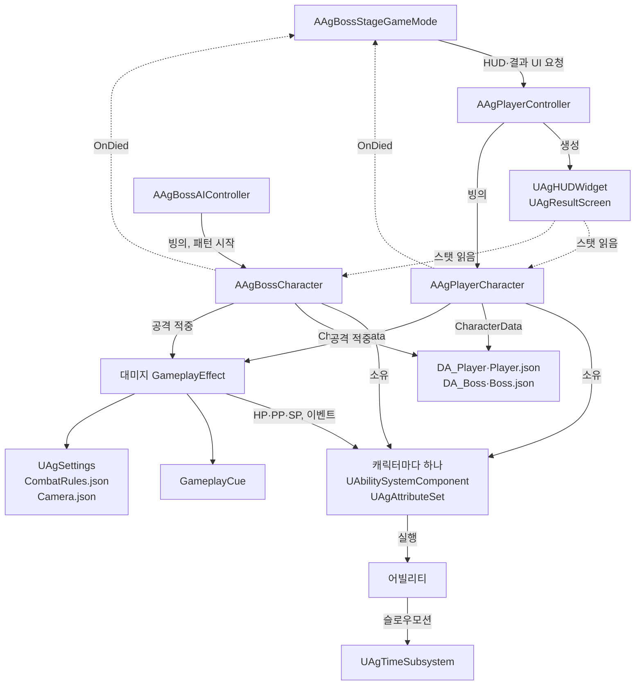
```mermaid
flowchart TB
    GM["AAgBossStageGameMode"]
    PC["AAgPlayerController"]
    UI["UAgHUDWidget<br>UAgResultScreen"]
    Player["AAgPlayerCharacter"]
    Boss["AAgBossCharacter"]
    AI["AAgBossAIController"]
    ASC["캐릭터마다 하나<br>UAbilitySystemComponent<br>UAgAttributeSet"]
    GA["어빌리티"]
    CharData["DA_Player·Player.json<br>DA_Boss·Boss.json"]
    Damage["대미지 GameplayEffect"]
    Time["UAgTimeSubsystem"]
    Cue["GameplayCue"]
    Shared["UAgSettings<br>CombatRules.json<br>Camera.json"]

    GM -->|HUD·결과 UI 요청| PC
    PC -->|생성| UI
    PC -->|빙의| Player
    AI -->|빙의, 패턴 시작| Boss
    Player & Boss -->|소유| ASC
    ASC -->|실행| GA
    Player & Boss -->|CharacterData| CharData
    Player & Boss -->|공격 적중| Damage
    Damage -->|HP·PP·SP, 이벤트| ASC
    Damage --> Cue & Shared
    GA -->|슬로우모션| Time
    UI -.->|스탯 읽음| Player & Boss
    Player & Boss -.->|OnDied| GM
```

## 캐릭터

플레이어·보스 캐릭터와 컴포넌트, 보스를 움직이는 AI 컨트롤러입니다.

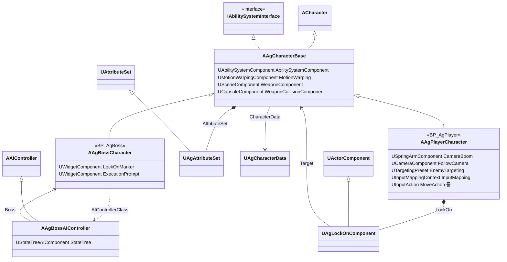
```mermaid
classDiagram
    direction TB
    class IAbilitySystemInterface {
        <<interface>>
    }
    class AAgCharacterBase {
        UAbilitySystemComponent AbilitySystemComponent
        UMotionWarpingComponent MotionWarping
        USceneComponent WeaponComponent
        UCapsuleComponent WeaponCollisionComponent
    }
    class AAgPlayerCharacter {
        <<BP_AgPlayer>>
        USpringArmComponent CameraBoom
        UCameraComponent FollowCamera
        UTargetingPreset EnemyTargeting
        UInputMappingContext InputMapping
        UInputAction MoveAction 등
    }
    class AAgBossCharacter {
        <<BP_AgBoss>>
        UWidgetComponent LockOnMarker
        UWidgetComponent ExecutionPrompt
    }
    class AAgBossAIController {
        UStateTreeAIComponent StateTree
    }
    ACharacter <|-- AAgCharacterBase
    IAbilitySystemInterface <|.. AAgCharacterBase
    AAgCharacterBase <|-- AAgPlayerCharacter
    AAgCharacterBase <|-- AAgBossCharacter

    AAgCharacterBase *-- UAgAttributeSet : AttributeSet
    UAttributeSet <|-- UAgAttributeSet
    AAgCharacterBase --> UAgCharacterData : CharacterData
    AAgPlayerCharacter *-- UAgLockOnComponent : LockOn
    UActorComponent <|-- UAgLockOnComponent
    UAgLockOnComponent --> AAgCharacterBase : Target
    AAgBossCharacter ..> AAgBossAIController : AIControllerClass
    AAIController <|-- AAgBossAIController
    AAgBossAIController --> AAgBossCharacter : Boss
```

## 보스 AI

보스 AI의 흐름(상태와 전환)은 StateTree 에셋 `ST_Boss`에 있어 에디터에서 그림으로 봅니다. 아래는 그 에셋을 실행하는 코드입니다. 태스크와 조건은 모두 `Controller`(Context 속성)로 `AAgBossAIController`를 받아 보스, 보스 데이터, 현재 대상(`GetTarget`)을 읽으며, 그 선은 그리지 않습니다.

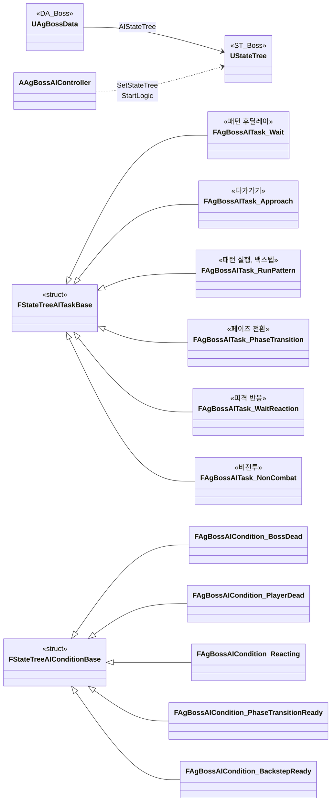
```mermaid
classDiagram
    direction LR
    class UAgBossData {
        <<DA_Boss>>
    }
    class UStateTree {
        <<ST_Boss>>
    }
    class FStateTreeAITaskBase {
        <<struct>>
    }
    class FStateTreeAIConditionBase {
        <<struct>>
    }
    class FAgBossAITask_Wait {
        <<패턴 후딜레이>>
    }
    class FAgBossAITask_Approach {
        <<다가가기>>
    }
    class FAgBossAITask_RunPattern {
        <<패턴 실행, 백스텝>>
    }
    class FAgBossAITask_PhaseTransition {
        <<페이즈 전환>>
    }
    class FAgBossAITask_WaitReaction {
        <<피격 반응>>
    }
    class FAgBossAITask_NonCombat {
        <<비전투>>
    }
    UAgBossData --> UStateTree : AIStateTree
    AAgBossAIController ..> UStateTree : SetStateTree<br>StartLogic
    FStateTreeAITaskBase <|-- FAgBossAITask_Wait
    FStateTreeAITaskBase <|-- FAgBossAITask_Approach
    FStateTreeAITaskBase <|-- FAgBossAITask_RunPattern
    FStateTreeAITaskBase <|-- FAgBossAITask_PhaseTransition
    FStateTreeAITaskBase <|-- FAgBossAITask_WaitReaction
    FStateTreeAITaskBase <|-- FAgBossAITask_NonCombat
    FStateTreeAIConditionBase <|-- FAgBossAICondition_BossDead
    FStateTreeAIConditionBase <|-- FAgBossAICondition_PlayerDead
    FStateTreeAIConditionBase <|-- FAgBossAICondition_Reacting
    FStateTreeAIConditionBase <|-- FAgBossAICondition_PhaseTransitionReady
    FStateTreeAIConditionBase <|-- FAgBossAICondition_BackstepReady
```

## 애니메이션

`ABP_Ag`의 부모와 몽타주에 넣는 노티파이입니다.

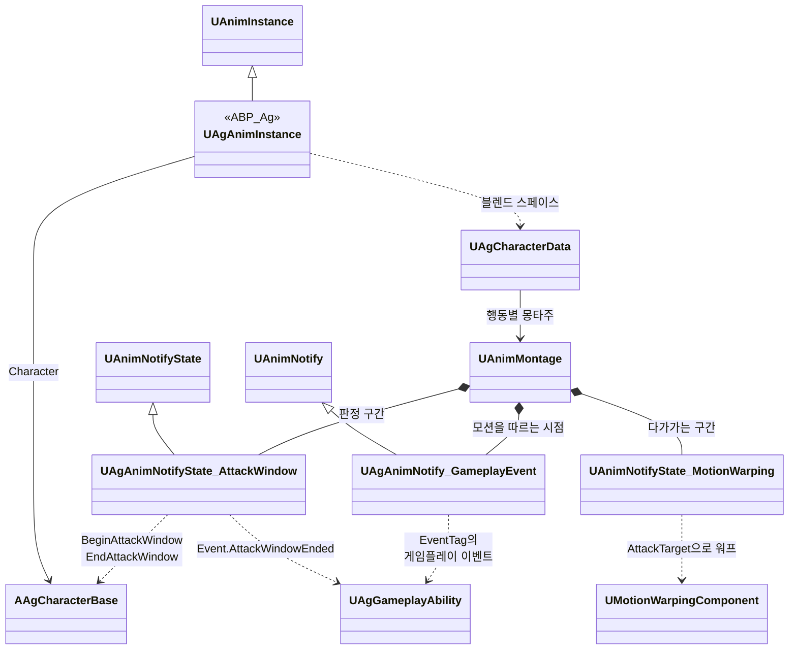
```mermaid
classDiagram
    direction TB
    class UAgAnimInstance {
        <<ABP_Ag>>
    }
    UAnimInstance <|-- UAgAnimInstance
    UAgAnimInstance --> AAgCharacterBase : Character
    UAgAnimInstance ..> UAgCharacterData : 블렌드 스페이스

    UAnimNotifyState <|-- UAgAnimNotifyState_AttackWindow
    UAnimNotify <|-- UAgAnimNotify_GameplayEvent
    UAgCharacterData --> UAnimMontage : 행동별 몽타주
    UAnimMontage *-- UAgAnimNotifyState_AttackWindow : 판정 구간
    UAnimMontage *-- UAgAnimNotify_GameplayEvent : 모션을 따르는 시점
    UAgAnimNotifyState_AttackWindow ..> AAgCharacterBase : BeginAttackWindow<br>EndAttackWindow
    UAgAnimNotifyState_AttackWindow ..> UAgGameplayAbility : Event.AttackWindowEnded
    UAgAnimNotify_GameplayEvent ..> UAgGameplayAbility : EventTag의<br>게임플레이 이벤트
    UAnimMontage *-- UAnimNotifyState_MotionWarping : 다가가는 구간
    UAnimNotifyState_MotionWarping ..> UMotionWarpingComponent : AttackTarget으로 워프
```

## 어빌리티

모든 어빌리티는 `UGameplayAbility`를 상속한 `UAgGameplayAbility`를 바로 상속하고, 여러 어빌리티가 함께 쓰는 동작은 어빌리티 태스크로 씁니다([마일스톤1 구현 계획](<마일스톤1 구현 계획.md>) '어빌리티 구조'). 플레이어 행동, 상태, 보스 패턴으로 나눠 그립니다.

### 플레이어 행동

공격 행동(평타, 회피 반격, 스킬, 궁극기)은 플레이어 공격 태스크로 몽타주와 타마다의 이동을 처리합니다.

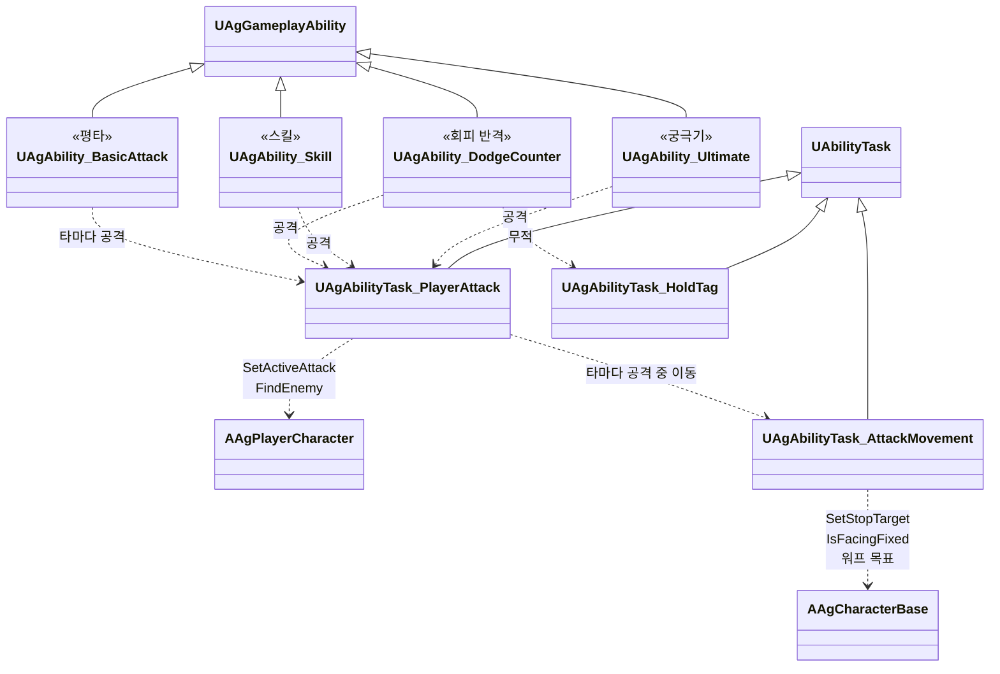
```mermaid
classDiagram
    direction TB
    class UAgAbility_BasicAttack {
        <<평타>>
    }
    class UAgAbility_DodgeCounter {
        <<회피 반격>>
    }
    class UAgAbility_Skill {
        <<스킬>>
    }
    class UAgAbility_Ultimate {
        <<궁극기>>
    }
    UAgGameplayAbility <|-- UAgAbility_BasicAttack
    UAgGameplayAbility <|-- UAgAbility_DodgeCounter
    UAgGameplayAbility <|-- UAgAbility_Skill
    UAgGameplayAbility <|-- UAgAbility_Ultimate

    UAgAbility_BasicAttack ..> UAgAbilityTask_PlayerAttack : 타마다 공격
    UAgAbility_DodgeCounter ..> UAgAbilityTask_PlayerAttack : 공격
    UAgAbility_Skill ..> UAgAbilityTask_PlayerAttack : 공격
    UAgAbility_Ultimate ..> UAgAbilityTask_PlayerAttack : 공격
    UAgAbility_DodgeCounter ..> UAgAbilityTask_HoldTag : 무적
    UAgAbilityTask_PlayerAttack ..> AAgPlayerCharacter : SetActiveAttack<br>FindEnemy
    UAgAbilityTask_PlayerAttack ..> UAgAbilityTask_AttackMovement : 타마다 공격 중 이동
    UAgAbilityTask_AttackMovement ..> AAgCharacterBase : SetStopTarget<br>IsFacingFixed<br>워프 목표
    UAbilityTask <|-- UAgAbilityTask_PlayerAttack
    UAbilityTask <|-- UAgAbilityTask_AttackMovement
    UAbilityTask <|-- UAgAbilityTask_HoldTag
```

그 밖의 행동입니다.

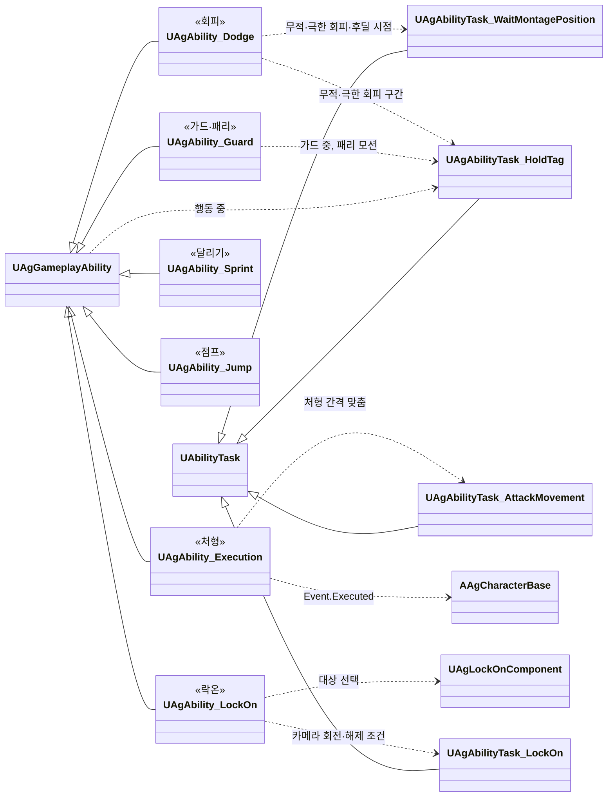
```mermaid
classDiagram
    direction LR
    class UAgAbility_Dodge {
        <<회피>>
    }
    class UAgAbility_Guard {
        <<가드·패리>>
    }
    class UAgAbility_Execution {
        <<처형>>
    }
    class UAgAbility_Sprint {
        <<달리기>>
    }
    class UAgAbility_Jump {
        <<점프>>
    }
    class UAgAbility_LockOn {
        <<락온>>
    }
    UAgGameplayAbility <|-- UAgAbility_Dodge
    UAgGameplayAbility <|-- UAgAbility_Guard
    UAgGameplayAbility <|-- UAgAbility_Execution
    UAgGameplayAbility <|-- UAgAbility_Sprint
    UAgGameplayAbility <|-- UAgAbility_Jump
    UAgGameplayAbility <|-- UAgAbility_LockOn

    UAgAbility_Execution ..> UAgAbilityTask_AttackMovement : 처형 간격 맞춤
    UAgAbility_Dodge ..> UAgAbilityTask_WaitMontagePosition : 무적·극한 회피·후딜 시점
    UAgAbility_Dodge ..> UAgAbilityTask_HoldTag : 무적·극한 회피 구간
    UAgAbility_Guard ..> UAgAbilityTask_HoldTag : 가드 중, 패리 모션
    UAgGameplayAbility ..> UAgAbilityTask_HoldTag : 행동 중
    UAgAbility_Execution ..> AAgCharacterBase : Event.Executed
    UAgAbility_LockOn ..> UAgLockOnComponent : 대상 선택
    UAgAbility_LockOn ..> UAgAbilityTask_LockOn : 카메라 회전·해제 조건
    UAbilityTask <|-- UAgAbilityTask_WaitMontagePosition
    UAbilityTask <|-- UAgAbilityTask_LockOn
    UAbilityTask <|-- UAgAbilityTask_AttackMovement
    UAbilityTask <|-- UAgAbilityTask_HoldTag
```

### 상태

상태 어빌리티는 게임플레이 이벤트로 시작합니다('주요 흐름'의 '공격 판정과 피격 처리').

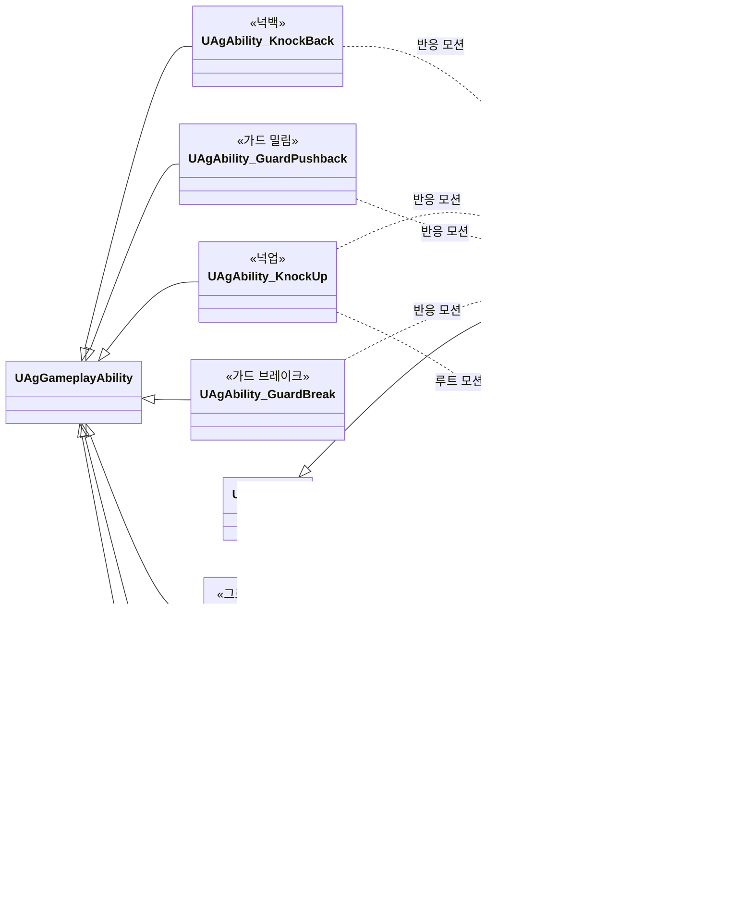
```mermaid
classDiagram
    direction LR
    class UAgAbility_KnockBack {
        <<넉백>>
    }
    class UAgAbility_KnockUp {
        <<넉업>>
    }
    class UAgAbility_GuardPushback {
        <<가드 밀림>>
    }
    class UAgAbility_GuardBreak {
        <<가드 브레이크>>
    }
    class UAgAbility_Groggy {
        <<그로기, 처형 피격>>
    }
    class UAgAbility_PhaseTransition {
        <<페이즈 전환>>
    }
    class UAgAbility_Death {
        <<사망>>
    }
    UAgGameplayAbility <|-- UAgAbility_KnockBack
    UAgGameplayAbility <|-- UAgAbility_KnockUp
    UAgGameplayAbility <|-- UAgAbility_GuardPushback
    UAgGameplayAbility <|-- UAgAbility_GuardBreak
    UAgGameplayAbility <|-- UAgAbility_Groggy
    UAgGameplayAbility <|-- UAgAbility_PhaseTransition
    UAgGameplayAbility <|-- UAgAbility_Death

    UAgAbility_KnockBack ..> UAgAbilityTask_PlayReaction : 반응 모션
    UAgAbility_KnockUp ..> UAgAbilityTask_PlayReaction : 반응 모션
    UAgAbility_GuardPushback ..> UAgAbilityTask_PlayReaction : 반응 모션
    UAgAbility_GuardBreak ..> UAgAbilityTask_PlayReaction : 반응 모션
    UAgAbility_KnockUp ..> UAgAbilityTask_IgnoreRootMotion : 루트 모션 무시
    UAbilityTask <|-- UAgAbilityTask_PlayReaction
    UAbilityTask <|-- UAgAbilityTask_IgnoreRootMotion
    UAgAbility_Groggy ..> AAgBossCharacter : SetGroggyTimerRunning
    UAgAbility_PhaseTransition ..> AAgBossCharacter : EnterPhase2
    UAgAbility_Death ..> AAgCharacterBase : Die
```

### 보스 패턴

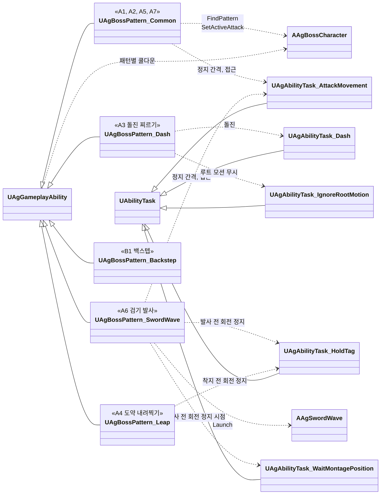
```mermaid
classDiagram
    direction LR
    class UAgBossPattern_Common {
        <<A1, A2, A5, A7>>
    }
    class UAgBossPattern_Dash {
        <<A3 돌진 찌르기>>
    }
    class UAgBossPattern_Leap {
        <<A4 도약 내려찍기>>
    }
    class UAgBossPattern_SwordWave {
        <<A6 검기 발사>>
    }
    class UAgBossPattern_Backstep {
        <<B1 백스텝>>
    }
    UAgGameplayAbility <|-- UAgBossPattern_Common
    UAgGameplayAbility <|-- UAgBossPattern_Dash
    UAgGameplayAbility <|-- UAgBossPattern_Leap
    UAgGameplayAbility <|-- UAgBossPattern_SwordWave
    UAgGameplayAbility <|-- UAgBossPattern_Backstep

    UAgBossPattern_Common ..> AAgBossCharacter : FindPattern<br>SetActiveAttack
    UAgBossPattern_Common ..> UAgAbilityTask_AttackMovement : 정지 간격, 접근
    UAgBossPattern_SwordWave ..> UAgAbilityTask_AttackMovement : 정지 간격, 접근
    UAgBossPattern_Dash ..> UAgAbilityTask_Dash : 돌진
    UAgBossPattern_Dash ..> UAgAbilityTask_IgnoreRootMotion : 루트 모션 무시
    UAgBossPattern_SwordWave ..> AAgSwordWave : Launch
    UAgBossPattern_SwordWave ..> UAgAbilityTask_WaitMontagePosition : 발사 전 회전 정지 시점
    UAgBossPattern_SwordWave ..> UAgAbilityTask_HoldTag : 발사 전 회전 정지
    UAgBossPattern_Leap ..> UAgAbilityTask_HoldTag : 착지 전 회전 정지
    UAgGameplayAbility ..> AAgBossCharacter : 패턴별 쿨다운
    UAbilityTask <|-- UAgAbilityTask_Dash
    UAbilityTask <|-- UAgAbilityTask_IgnoreRootMotion
    UAbilityTask <|-- UAgAbilityTask_AttackMovement
    UAbilityTask <|-- UAgAbilityTask_WaitMontagePosition
    UAbilityTask <|-- UAgAbilityTask_HoldTag
```

## 전투

### 피격 처리와 시간

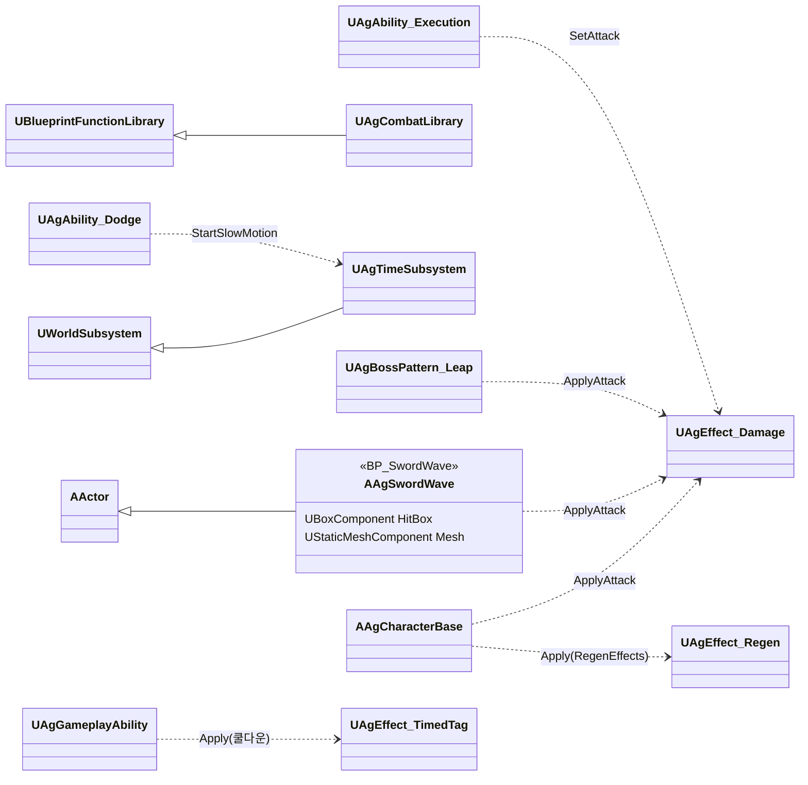
```mermaid
classDiagram
    direction LR
    class AAgSwordWave {
        <<BP_SwordWave>>
        UBoxComponent HitBox
        UStaticMeshComponent Mesh
    }
    UBlueprintFunctionLibrary <|-- UAgCombatLibrary
    UWorldSubsystem <|-- UAgTimeSubsystem
    AActor <|-- AAgSwordWave

    AAgCharacterBase ..> UAgEffect_Damage : ApplyAttack
    AAgSwordWave ..> UAgEffect_Damage : ApplyAttack
    UAgBossPattern_Leap ..> UAgEffect_Damage : ApplyAttack
    UAgAbility_Execution ..> UAgEffect_Damage : SetAttack
    AAgCharacterBase ..> UAgEffect_Regen : Apply(RegenEffects)
    UAgGameplayAbility ..> UAgEffect_TimedTag : Apply(쿨다운)
    UAgAbility_Dodge ..> UAgTimeSubsystem : StartSlowMotion
```

### GameplayEffect

GameplayEffect는 모두 C++ 클래스입니다. 대미지 GameplayEffect는 공격하는 쪽(무기 스윕, 검기, A4 착지, 처형)이 적용하고, 피격 처리는 그 안에서 끝납니다. 계산 클래스가 피격 결과를 정해 스펙 태그로 남기고, 어트리뷰트 세트가 사망·그로기를 판정하며, 결과 처리 컴포넌트가 반응과 적중 후 처리를 합니다. 행동 비용은 어빌리티의 비용 GameplayEffect로 엔진이 치르고, 자원 얻기, PP 회복, 패리로 잃는 PP는 그 일을 하는 어빌리티나 결과 처리 컴포넌트가 적용합니다. 시간 태그 GameplayEffect는 그 클래스의 함수(`Apply`)로 적용하고, 리젠 GameplayEffect는 캐릭터가 시작할 때 캐릭터 데이터의 목록(`RegenEffects`)대로 겁니다. 리젠의 회복량은 크기 계산 클래스가 주기마다 캐릭터 데이터에서 읽습니다.

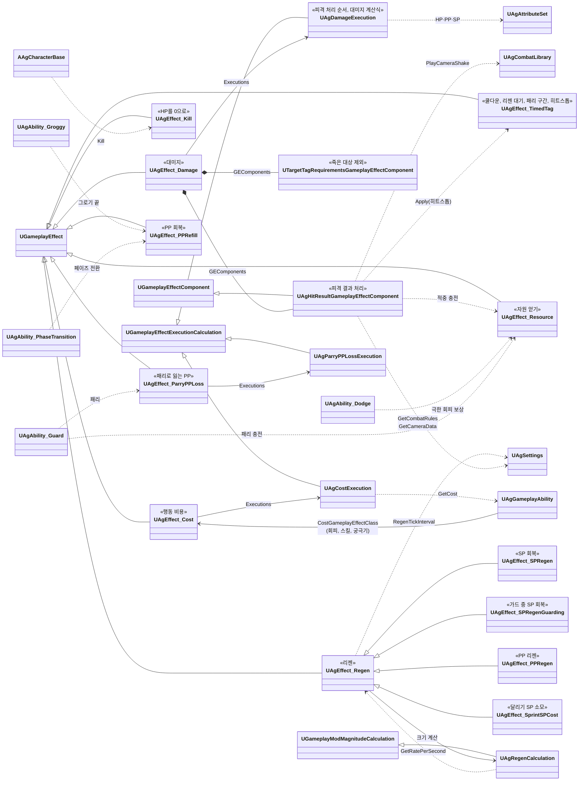
```mermaid
classDiagram
    direction LR
    class UAgEffect_Damage {
        <<대미지>>
    }
    class UAgDamageExecution {
        <<피격 처리 순서, 대미지 계산식>>
    }
    class UAgHitResultGameplayEffectComponent {
        <<피격 결과 처리>>
    }
    class UTargetTagRequirementsGameplayEffectComponent {
        <<죽은 대상 제외>>
    }
    class UAgEffect_Kill {
        <<HP를 0으로>>
    }
    class UAgEffect_Resource {
        <<자원 얻기>>
    }
    class UAgEffect_Cost {
        <<행동 비용>>
    }
    class UAgEffect_PPRefill {
        <<PP 회복>>
    }
    class UAgEffect_ParryPPLoss {
        <<패리로 잃는 PP>>
    }
    class UAgEffect_TimedTag {
        <<쿨다운, 리젠 대기, 패리 구간, 히트스톱>>
    }
    class UAgEffect_Regen {
        <<리젠>>
    }
    class UAgEffect_SPRegen {
        <<SP 회복>>
    }
    class UAgEffect_SPRegenGuarding {
        <<가드 중 SP 회복>>
    }
    class UAgEffect_PPRegen {
        <<PP 리젠>>
    }
    class UAgEffect_SprintSPCost {
        <<달리기 SP 소모>>
    }
    UGameplayEffect <|-- UAgEffect_Damage
    UGameplayEffectExecutionCalculation <|-- UAgDamageExecution
    UAgEffect_Damage --> UAgDamageExecution : Executions
    UGameplayEffectComponent <|-- UAgHitResultGameplayEffectComponent
    UAgEffect_Damage *-- UAgHitResultGameplayEffectComponent : GEComponents
    UAgEffect_Damage *-- UTargetTagRequirementsGameplayEffectComponent : GEComponents
    UAgDamageExecution ..> UAgAttributeSet : HP·PP·SP
    UGameplayEffect <|-- UAgEffect_Kill
    UGameplayEffect <|-- UAgEffect_Resource
    UGameplayEffect <|-- UAgEffect_Cost
    UGameplayEffectExecutionCalculation <|-- UAgCostExecution
    UAgEffect_Cost --> UAgCostExecution : Executions
    UGameplayEffect <|-- UAgEffect_PPRefill
    UGameplayEffect <|-- UAgEffect_ParryPPLoss
    UGameplayEffectExecutionCalculation <|-- UAgParryPPLossExecution
    UAgEffect_ParryPPLoss --> UAgParryPPLossExecution : Executions
    UGameplayEffect <|-- UAgEffect_TimedTag
    UGameplayEffect <|-- UAgEffect_Regen
    UAgEffect_Regen <|-- UAgEffect_SPRegen
    UAgEffect_Regen <|-- UAgEffect_SPRegenGuarding
    UAgEffect_Regen <|-- UAgEffect_PPRegen
    UAgEffect_Regen <|-- UAgEffect_SprintSPCost
    UGameplayModMagnitudeCalculation <|-- UAgRegenCalculation
    UAgEffect_Regen --> UAgRegenCalculation : 크기 계산
    UAgRegenCalculation ..> UAgEffect_Regen : GetRatePerSecond
    UAgEffect_Regen ..> UAgSettings : RegenTickInterval

    AAgCharacterBase ..> UAgEffect_Kill : Kill
    UAgHitResultGameplayEffectComponent ..> UAgCombatLibrary : PlayCameraShake
    UAgHitResultGameplayEffectComponent ..> UAgEffect_TimedTag : Apply(히트스톱)
    UAgHitResultGameplayEffectComponent ..> UAgEffect_Resource : 적중 충전
    UAgGameplayAbility --> UAgEffect_Cost : CostGameplayEffectClass<br>(회피, 스킬, 궁극기)
    UAgCostExecution ..> UAgGameplayAbility : GetCost
    UAgAbility_Dodge ..> UAgEffect_Resource : 극한 회피 보상
    UAgAbility_Guard ..> UAgEffect_Resource : 패리 충전
    UAgAbility_Guard ..> UAgEffect_ParryPPLoss : 패리
    UAgAbility_Groggy ..> UAgEffect_PPRefill : 그로기 끝
    UAgAbility_PhaseTransition ..> UAgEffect_PPRefill : 페이즈 전환
    UAgHitResultGameplayEffectComponent ..> UAgSettings : GetCombatRules<br>GetCameraData
```

### GameplayCue

큐는 GameplayCue 태그로 실행합니다.

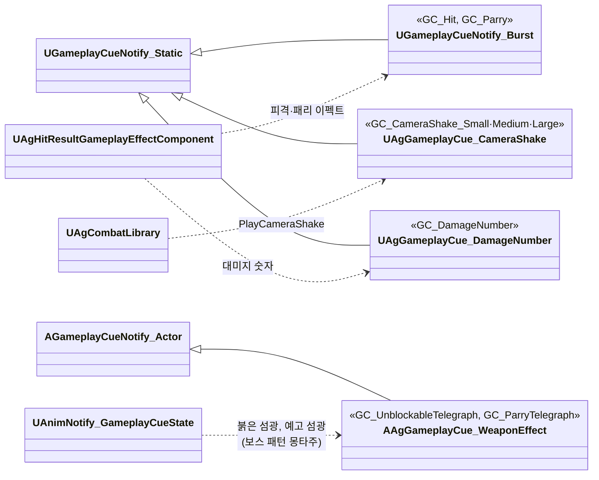
```mermaid
classDiagram
    direction LR
    class UGameplayCueNotify_Burst {
        <<GC_Hit, GC_Parry>>
    }
    class UAgGameplayCue_CameraShake {
        <<GC_CameraShake_Small·Medium·Large>>
    }
    class UAgGameplayCue_DamageNumber {
        <<GC_DamageNumber>>
    }
    class AAgGameplayCue_WeaponEffect {
        <<GC_UnblockableTelegraph, GC_ParryTelegraph>>
    }
    UGameplayCueNotify_Static <|-- UGameplayCueNotify_Burst
    UGameplayCueNotify_Static <|-- UAgGameplayCue_CameraShake
    UGameplayCueNotify_Static <|-- UAgGameplayCue_DamageNumber
    AGameplayCueNotify_Actor <|-- AAgGameplayCue_WeaponEffect

    UAgHitResultGameplayEffectComponent ..> UGameplayCueNotify_Burst : 피격·패리 이펙트
    UAgHitResultGameplayEffectComponent ..> UAgGameplayCue_DamageNumber : 대미지 숫자
    UAgCombatLibrary ..> UAgGameplayCue_CameraShake : PlayCameraShake
    UAnimNotify_GameplayCueState ..> AAgGameplayCue_WeaponEffect : 붉은 섬광, 예고 섬광<br>(보스 패턴 몽타주)
```

## 데이터

데이터를 데이터 에셋과 JSON 데이터 파일에 나눠 두는 방식은 [마일스톤1 구현 계획](<마일스톤1 구현 계획.md>)의 '기술 결정' '데이터'를, 필드가 기획서의 어느 항목인지는 [데이터 위치표](<데이터 위치표.md>)를 따릅니다.

### 캐릭터 데이터

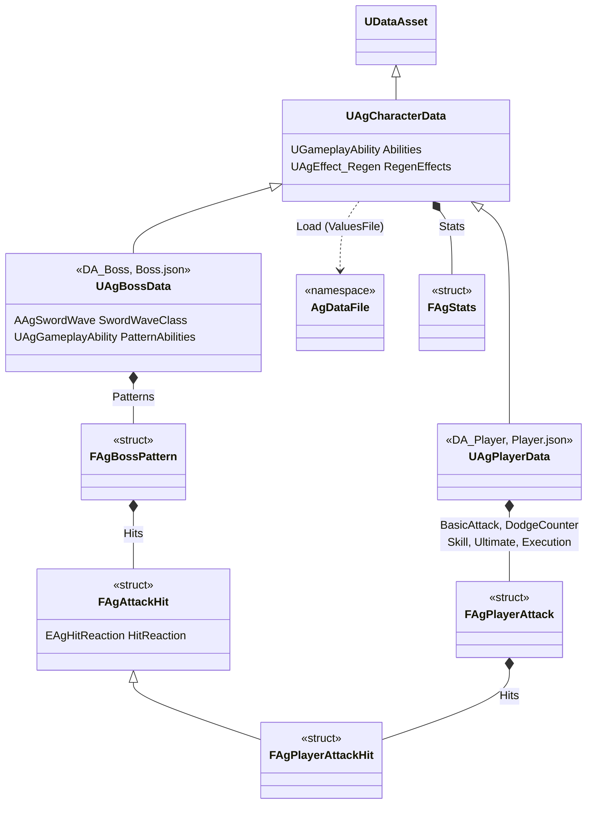
```mermaid
classDiagram
    direction TB
    class UAgCharacterData {
        UGameplayAbility Abilities
        UAgEffect_Regen RegenEffects
    }
    class UAgPlayerData {
        <<DA_Player, Player.json>>
    }
    class UAgBossData {
        <<DA_Boss, Boss.json>>
        AAgSwordWave SwordWaveClass
        UAgGameplayAbility PatternAbilities
    }
    class AgDataFile {
        <<namespace>>
    }
    class FAgStats {
        <<struct>>
    }
    class FAgPlayerAttack {
        <<struct>>
    }
    class FAgBossPattern {
        <<struct>>
    }
    class FAgAttackHit {
        <<struct>>
        EAgHitReaction HitReaction
    }
    class FAgPlayerAttackHit {
        <<struct>>
    }
    UDataAsset <|-- UAgCharacterData
    UAgCharacterData <|-- UAgPlayerData
    UAgCharacterData <|-- UAgBossData
    UAgCharacterData ..> AgDataFile : Load (ValuesFile)

    UAgCharacterData *-- FAgStats : Stats
    UAgPlayerData *-- FAgPlayerAttack : BasicAttack, DodgeCounter<br>Skill, Ultimate, Execution
    UAgBossData *-- FAgBossPattern : Patterns
    FAgAttackHit <|-- FAgPlayerAttackHit
    FAgPlayerAttack *-- FAgPlayerAttackHit : Hits
    FAgBossPattern *-- FAgAttackHit : Hits
```

### 공통 데이터

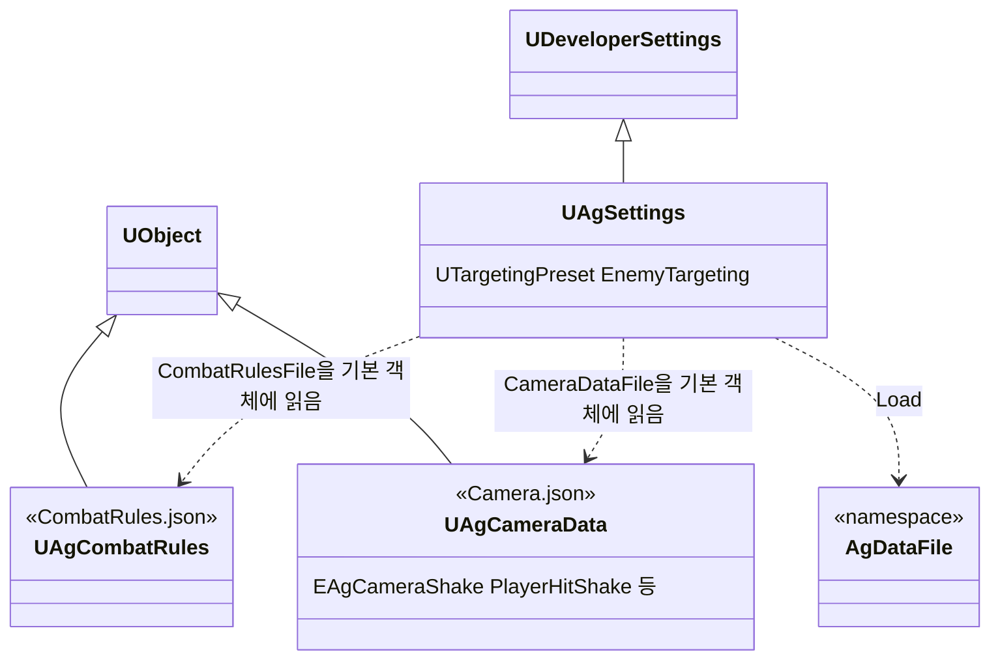
```mermaid
classDiagram
    direction TB
    class UAgSettings {
        UTargetingPreset EnemyTargeting
    }
    class UAgCombatRules {
        <<CombatRules.json>>
    }
    class UAgCameraData {
        <<Camera.json>>
        EAgCameraShake PlayerHitShake 등
    }
    class AgDataFile {
        <<namespace>>
    }
    UDeveloperSettings <|-- UAgSettings
    UObject <|-- UAgCombatRules
    UObject <|-- UAgCameraData
    UAgSettings ..> UAgCombatRules : CombatRulesFile을 기본 객체에 읽음
    UAgSettings ..> UAgCameraData : CameraDataFile을 기본 객체에 읽음
    UAgSettings ..> AgDataFile : Load
```

## 게임 흐름

### 게임 모드

레벨마다 하나씩 있고, 레벨 전환은 부모 `AAgGameMode`가 맡습니다.

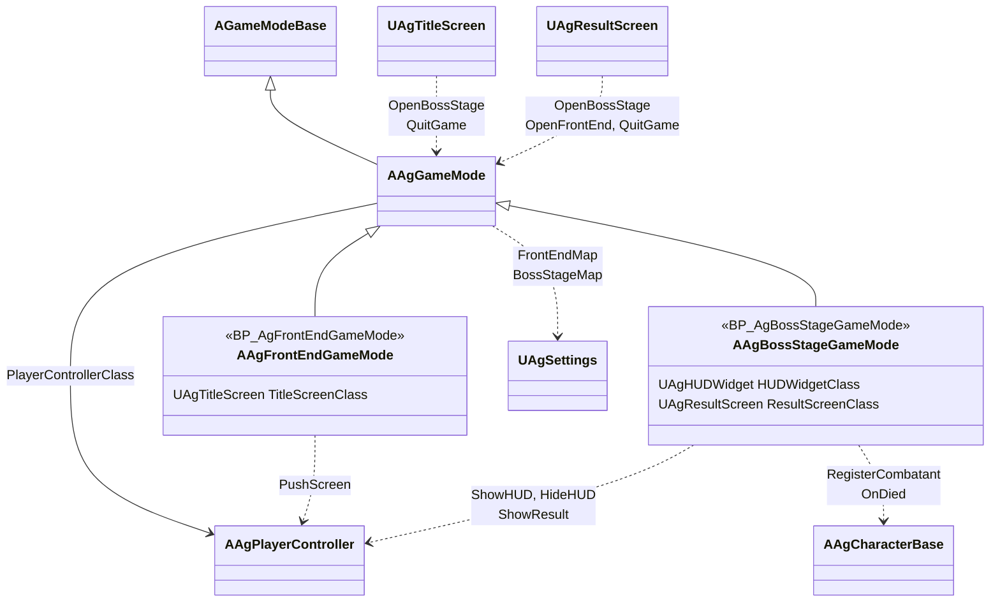
```mermaid
classDiagram
    direction TB
    class AAgFrontEndGameMode {
        <<BP_AgFrontEndGameMode>>
        UAgTitleScreen TitleScreenClass
    }
    class AAgBossStageGameMode {
        <<BP_AgBossStageGameMode>>
        UAgHUDWidget HUDWidgetClass
        UAgResultScreen ResultScreenClass
    }
    AGameModeBase <|-- AAgGameMode
    AAgGameMode <|-- AAgFrontEndGameMode
    AAgGameMode <|-- AAgBossStageGameMode

    AAgGameMode --> AAgPlayerController : PlayerControllerClass
    AAgGameMode ..> UAgSettings : FrontEndMap<br>BossStageMap
    AAgFrontEndGameMode ..> AAgPlayerController : PushScreen
    AAgBossStageGameMode ..> AAgPlayerController : ShowHUD, HideHUD<br>ShowResult
    AAgBossStageGameMode ..> AAgCharacterBase : RegisterCombatant<br>OnDied
    UAgTitleScreen ..> AAgGameMode : OpenBossStage<br>QuitGame
    UAgResultScreen ..> AAgGameMode : OpenBossStage<br>OpenFrontEnd, QuitGame
```

### 플레이어 컨트롤러

화면 UI를 만들고, 테스트용 콘솔 명령을 붙입니다.

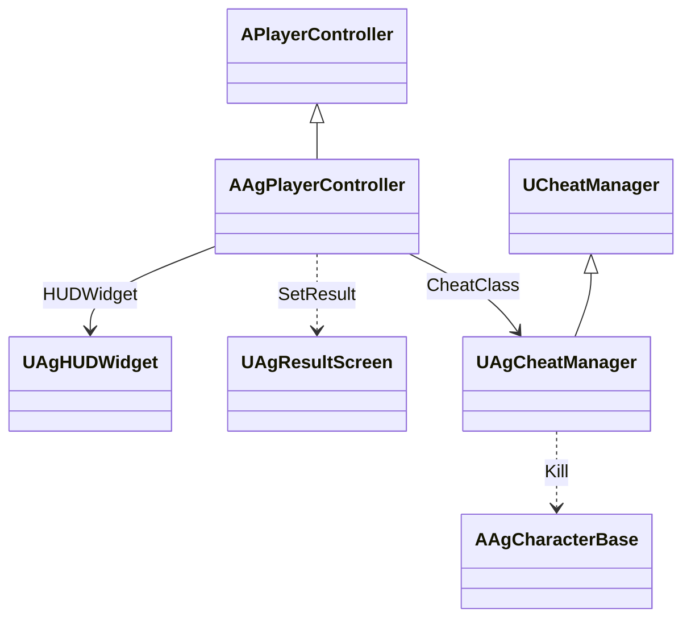
```mermaid
classDiagram
    direction TB
    APlayerController <|-- AAgPlayerController
    AAgPlayerController --> UAgHUDWidget : HUDWidget
    AAgPlayerController ..> UAgResultScreen : SetResult
    AAgPlayerController --> UAgCheatManager : CheatClass
    UCheatManager <|-- UAgCheatManager
    UAgCheatManager ..> AAgCharacterBase : Kill
```

## UI

### 화면 UI와 HUD

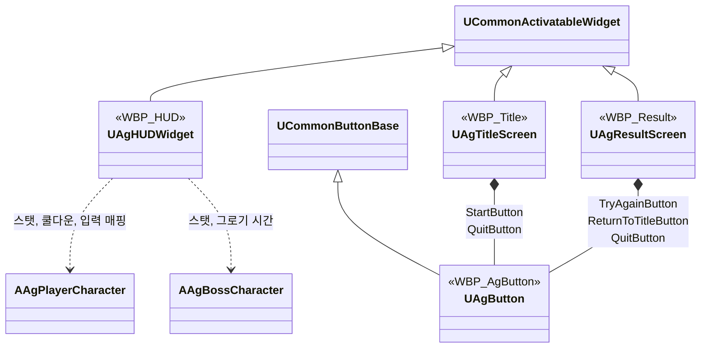
```mermaid
classDiagram
    direction TB
    class UAgHUDWidget {
        <<WBP_HUD>>
    }
    class UAgTitleScreen {
        <<WBP_Title>>
    }
    class UAgResultScreen {
        <<WBP_Result>>
    }
    class UAgButton {
        <<WBP_AgButton>>
    }
    UCommonActivatableWidget <|-- UAgHUDWidget
    UCommonActivatableWidget <|-- UAgTitleScreen
    UCommonActivatableWidget <|-- UAgResultScreen
    UCommonButtonBase <|-- UAgButton

    UAgTitleScreen *-- UAgButton : StartButton<br>QuitButton
    UAgResultScreen *-- UAgButton : TryAgainButton<br>ReturnToTitleButton<br>QuitButton
    UAgHUDWidget ..> AAgPlayerCharacter : 스탯, 쿨다운, 입력 매핑
    UAgHUDWidget ..> AAgBossCharacter : 스탯, 그로기 시간
```

### 월드 위치 HUD

보스에 붙어 월드 위치에 표시하는 위젯과, 대미지 숫자 큐가 맞은 위치에 띄우는 대미지 숫자입니다.

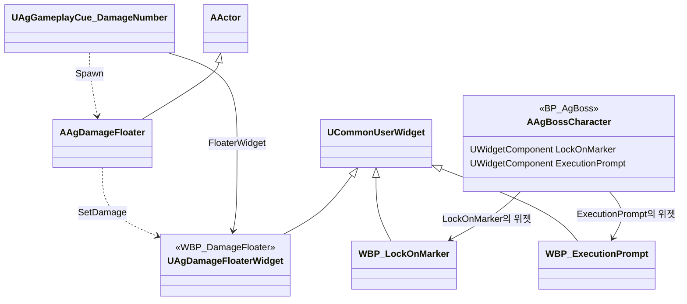
```mermaid
classDiagram
    direction TB
    class AAgBossCharacter {
        <<BP_AgBoss>>
        UWidgetComponent LockOnMarker
        UWidgetComponent ExecutionPrompt
    }
    class UAgDamageFloaterWidget {
        <<WBP_DamageFloater>>
    }
    UAgGameplayCue_DamageNumber ..> AAgDamageFloater : Spawn
    AActor <|-- AAgDamageFloater
    AAgDamageFloater ..> UAgDamageFloaterWidget : SetDamage
    UAgGameplayCue_DamageNumber --> UAgDamageFloaterWidget : FloaterWidget
    UCommonUserWidget <|-- UAgDamageFloaterWidget
    UCommonUserWidget <|-- WBP_LockOnMarker
    UCommonUserWidget <|-- WBP_ExecutionPrompt
    AAgBossCharacter --> WBP_LockOnMarker : LockOnMarker의 위젯
    AAgBossCharacter --> WBP_ExecutionPrompt : ExecutionPrompt의 위젯
```

## 주요 흐름

클래스 그림만으로는 보이지 않는 실행 순서입니다.

### 입력에서 행동까지

이동은 캐릭터 무브먼트로 갑니다. 락온 키는 선입력과 행동 제한을 거치지 않고 바로 `RunInput`으로 가서 락온 어빌리티를 시작하거나 끝냅니다. 나머지 행동 키는 아래처럼 어빌리티로 갑니다.

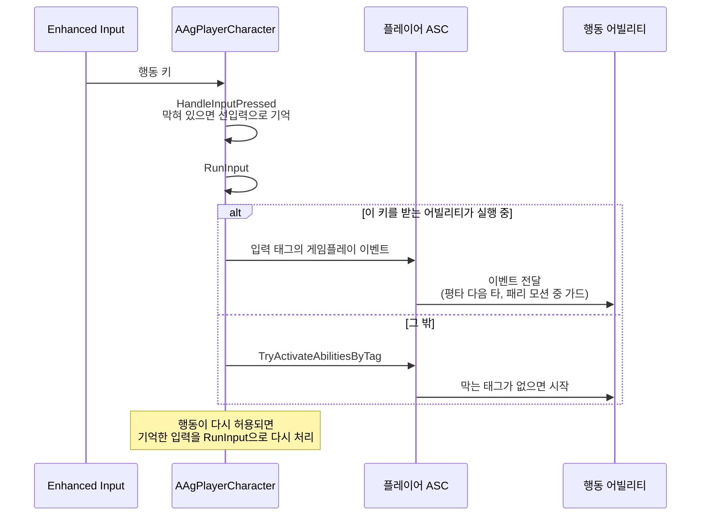
```mermaid
sequenceDiagram
    participant In as Enhanced Input
    participant P as AAgPlayerCharacter
    participant ASC as 플레이어 ASC
    participant GA as 행동 어빌리티
    In->>P: 행동 키
    P->>P: HandleInputPressed<br>막혀 있으면 선입력으로 기억
    P->>P: RunInput
    alt 이 키를 받는 어빌리티가 실행 중
        P->>ASC: 입력 태그의 게임플레이 이벤트
        ASC->>GA: 이벤트 전달<br>(평타 다음 타, 패리 모션 중 가드)
    else 그 밖
        P->>ASC: TryActivateAbilitiesByTag
        ASC->>GA: 막는 태그가 없으면 시작
    end
    Note over P: 행동이 다시 허용되면<br>기억한 입력을 RunInput으로 다시 처리
```

### 공격 판정과 피격 처리

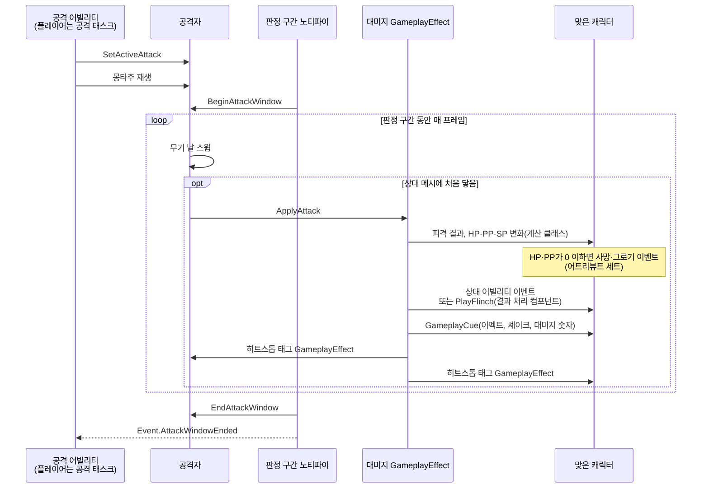
```mermaid
sequenceDiagram
    participant GA as 공격 어빌리티<br>(플레이어는 공격 태스크)
    participant A as 공격자
    participant N as 판정 구간 노티파이
    participant G as 대미지 GameplayEffect
    participant T as 맞은 캐릭터
    GA->>A: SetActiveAttack
    GA->>A: 몽타주 재생
    N->>A: BeginAttackWindow
    loop 판정 구간 동안 매 프레임
        A->>A: 무기 날 스윕
        opt 상대 메시에 처음 닿음
            A->>G: ApplyAttack
            G->>T: 피격 결과, HP·PP·SP 변화(계산 클래스)
            Note over T: HP·PP가 0 이하면 사망·그로기 이벤트<br>(어트리뷰트 세트)
            G->>T: 상태 어빌리티 이벤트<br>또는 PlayFlinch(결과 처리 컴포넌트)
            G->>T: GameplayCue(이펙트, 셰이크, 대미지 숫자)
            G->>A: 히트스톱 태그 GameplayEffect
            G->>T: 히트스톱 태그 GameplayEffect
        end
    end
    N->>A: EndAttackWindow
    N-->>GA: Event.AttackWindowEnded
```

A6 검기는 `AAgSwordWave`가, A4 착지는 `UAgBossPattern_Leap`이 같은 함수(`ApplyAttack`)로 대미지 GameplayEffect를 적용합니다. 처형의 타격은 `UAgAbility_Execution`이 스펙을 만들어 공격을 담고(`SetAttack`) 적용하며, 엔진이 스펙에 넣는 처형 어빌리티 태그로 처형의 셰이크와 히트스톱 없음이 정해집니다.

### 보스 패턴 실행

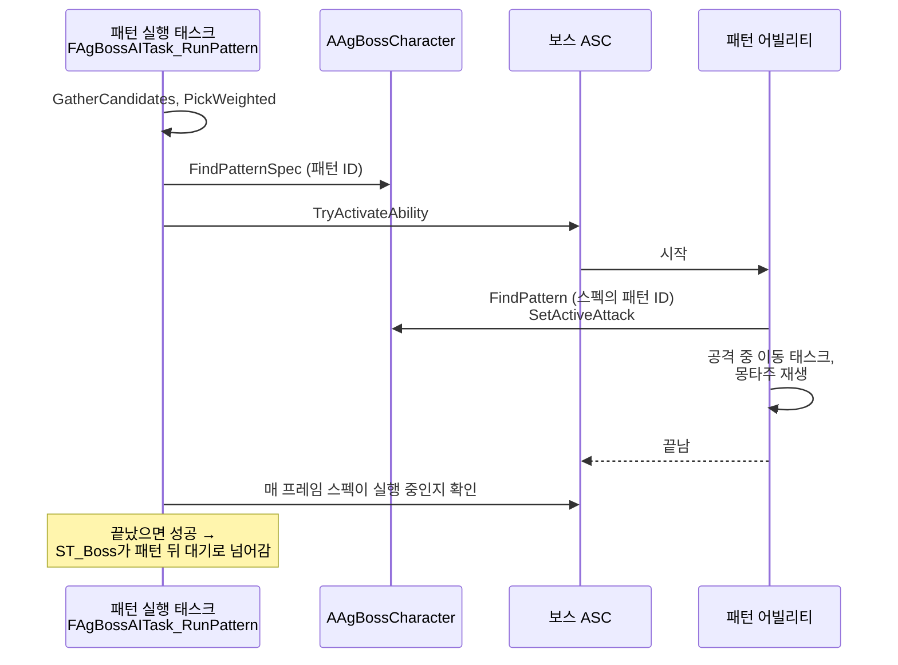
```mermaid
sequenceDiagram
    participant T as 패턴 실행 태스크<br>FAgBossAITask_RunPattern
    participant B as AAgBossCharacter
    participant ASC as 보스 ASC
    participant GA as 패턴 어빌리티
    T->>T: GatherCandidates, PickWeighted
    T->>B: FindPatternSpec (패턴 ID)
    T->>ASC: TryActivateAbility
    ASC->>GA: 시작
    GA->>B: FindPattern (스펙의 패턴 ID)<br>SetActiveAttack
    GA->>GA: 공격 중 이동 태스크,<br>몽타주 재생
    GA-->>ASC: 끝남
    T->>ASC: 매 프레임 스펙이 실행 중인지 확인
    Note over T: 끝났으면 성공 →<br>ST_Boss가 패턴 뒤 대기로 넘어감
```

B1은 컨트롤러가 대상(플레이어) ASC의 `Event.BasicAttackStarted` 가운데 그 타의 대상이 자기 보스인 것을 StateTree 이벤트로 넘기면 패턴 후딜레이 상태의 전환이 백스텝 상태로 보내 시작하고, 페이즈 전환은 페이즈 전환 태스크가 보스에게 `Event.PhaseTransition`을 보내 시작합니다.

### 사망에서 결과 UI까지

```mermaid
sequenceDiagram
    participant C as 죽는 캐릭터
    participant D as UAgAbility_Death
    participant GM as AAgBossStageGameMode
    participant PC as AAgPlayerController
    participant R as UAgResultScreen
    Note over C: Event.Death를 받음
    C->>D: 이벤트로 시작
    D->>C: Die
    C-->>GM: OnDied
    GM->>PC: HideHUD
    Note over GM: 사망 연출 시간 뒤
    GM->>PC: ShowResult
    PC->>R: PushScreen, SetResult
    R->>GM: 버튼에 따라<br>OpenBossStage 등
```

`Event.Death`는 GameplayEffect가 HP를 0 이하로 만들 때 어트리뷰트 세트(`PostGameplayEffectExecute`)가 보냅니다. 대미지 GameplayEffect와, `Kill`(Kill Z 낙하, 테스트용 콘솔 명령)이 적용하는 HP를 0으로 만드는 GameplayEffect가 모두 이 판정을 거칩니다. 보스와 플레이어의 사망은 StateTree의 전환 조건이 매 프레임 확인해, 보스 AI가 각각 사망 상태와 비전투 상태로 넘어갑니다.
